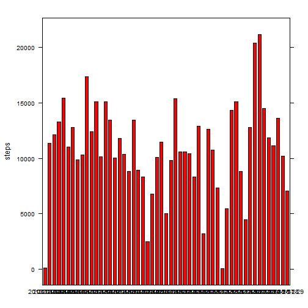
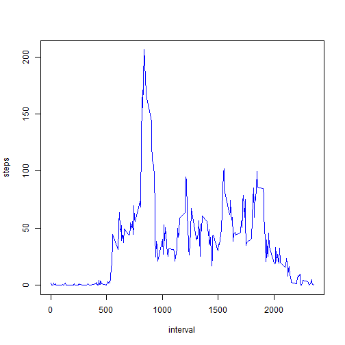
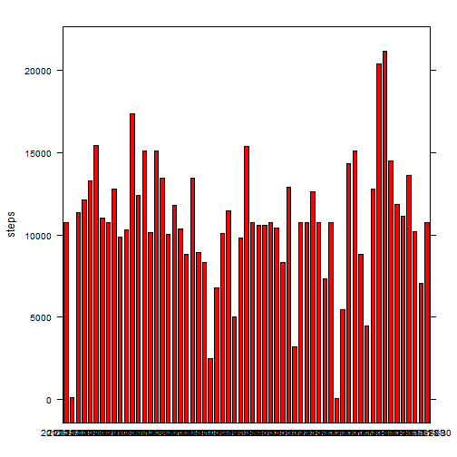
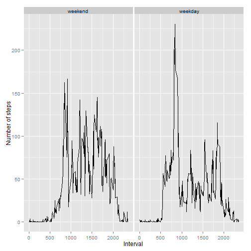

**Peer Assignment 1 Reproducible Research**  
**===========================**

**Loading and preprocessing the data**

First we shall load Activity.csv which is located in the working directory:


```r
act<-read.csv("activity.csv")
actperday <- aggregate(steps~date,act,sum,na.rm=T)
```

We create a new data frame by taking the sum of steps on each particular date.

**What is mean total number of steps taken per day?**

Q1: Make a histogram of the total number of steps taken each day

To answer this question, we use a barplot:


```r
library(lattice)
with(actperday,barchart(steps~date,col = "red"))
```

 

Q2: Calculate and report the mean and median total number of steps taken per day

Here we use the following code:


```r
mean(actperday$steps)
```

```
## [1] 10766
```

```r
median(actperday$steps)
```

```
## [1] 10765
```

**What is the average daily activity pattern?**

Q1: Make a time series plot (i.e. type = "l") of the 5-minute interval (x-axis) and the average number of steps taken, averaged across all days (y-axis)

First we take the sum over intervals:


```r
actperint <- aggregate(steps~interval,act,mean,na.rm=T)
```

then plot the chart:


```r
with(actperint,plot(interval,steps,type = "l",col = "blue"))
```

 

Q2: Which 5-minute interval, on average across all the days in the dataset, contains the maximum number of steps?

To answer this simply put:


```r
actperint2<-actperint[order(actperint$steps,decreasing = TRUE),]
actperint2[1,1]
```

```
## [1] 835
```

So, the interval between 0835 - 0840 contains the maximum average number of steps.  

**Imputing missing values**

Q1: Calculate and report the total number of missing values in the dataset (i.e. the total number of rows with NAs)

This can be done by:


```r
sum(is.na(act$steps))
```

```
## [1] 2304
```

Q2: Devise a strategy for filling in all of the missing values in the dataset. The strategy does not need to be sophisticated. For example, you could use the mean/median for that day, or the mean for that 5-minute interval, etc.

Q3: Create a new dataset that is equal to the original dataset but with the missing data filled in.

For Q2 and Q3, we use the mean for the corresponding non-NA 5-minute interval as replacement for all the intervals with NA readings. We first isolate the data with NA readings and merge it with the data frame actperint, which has the average of each non NA interval. After that, we rbind both data without NA (actreplace) and data with NAs where each has been replaced with mean for its 5-min interval (actmissing). 


```r
numofna<-sum(is.na(act$steps))

actreplace <- act

actreplace <- actreplace[order(actreplace$steps),]

actreplace2<- actreplace[(nrow(actreplace)-numofna+1):nrow(actreplace),2:3]

actreplace <- subset(actreplace,!is.na(steps))

actmissing <- merge(actreplace2,actperint)

actmissing <- data.frame(steps = actmissing$steps, date = actmissing$date, interval = actmissing$interval)

actreplace2 <- rbind(actreplace, actmissing)

actreplace2<-actreplace2[order(actreplace2$date),]
```

Q4: Make a histogram of the total number of steps taken each day and Calculate and report the mean and median total number of steps taken per day. Do these values differ from the estimates from the first part of the assignment? What is the impact of imputing missing data on the estimates of the total daily number of steps?

The plot is similar to the one we plotting earlier:


```r
actperdaynew <- aggregate(steps~date,actreplace2,sum)
with(actperdaynew,barchart(steps~date,col = "red"))
```

 

With mean and median:


```r
mean(actperdaynew$steps)
```

```
## [1] 10766
```

```r
median(actperdaynew$steps)
```

```
## [1] 10766
```

We can see that the median is slightly different from the previous one.

**Are there differences in activity patterns between weekdays and weekends?**

Q1: Create a new factor variable in the dataset with two levels - "weekday" and "weekend" indicating whether a given date is a weekday or weekend day.

This can be done with the following:


```r
actreplace2$date <- as.Date(actreplace2$date)

wd<-weekdays(actreplace2$date)

actperintnew<-cbind(wd,actreplace2)

wddata <- aggregate(steps ~ wd+interval,actperintnew,mean)

wddataend<-subset(wddata,wd == "Sunday"|wd == "Saturday")

wddataday<-subset(wddata,!(wd == "Sunday"|wd == "Saturday"))

wddatadayint <- aggregate(steps ~ interval,wddataday,mean)

wddataendint <- aggregate(steps ~ interval,wddataend,mean)

final1<-cbind(day = "weekend",wddataendint)

final2<-cbind(day = "weekday",wddatadayint)

final <- rbind(final1,final2)
```

Q2: Make a panel plot containing a time series plot (i.e. type = "l") of the 5-minute interval (x-axis) and the average number of steps taken, averaged across all weekday days or weekend days (y-axis). 

We shall use the qplot function for this:


```r
library(ggplot2)
qplot(interval,steps,data=final,facets=.~day,geom=c("line"),ylab = "Number of steps",xlab = "Interval")
```

 


